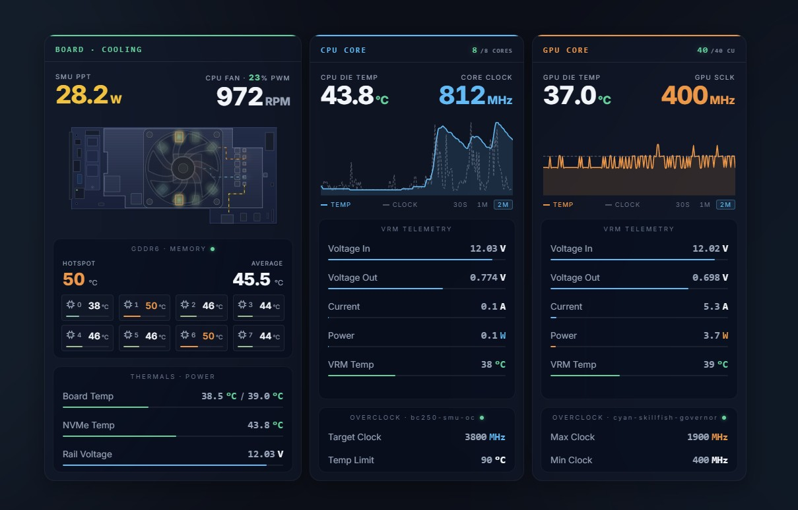
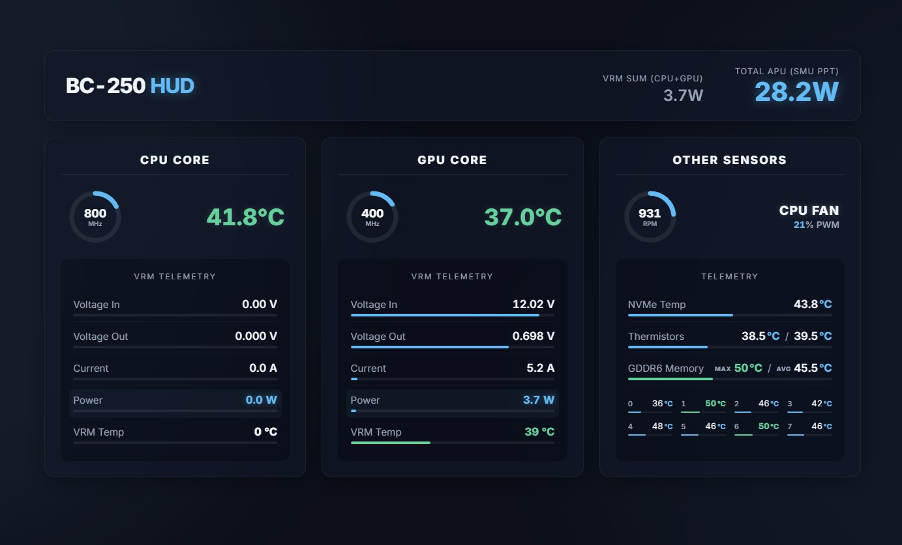

# BC-250 Telemetry

A telemetry daemon and web dashboard for the AMD BC-250 (Oberon / Cyan
Skillfish, `gfx1013`, PCI ID `1002:13fe`) — the decommissioned mining-board
APU carved out of the PS5. Runs on Bazzite, SteamOS, and CachyOS from the
same binary.

It merges two data sources into one JSON snapshot every ~700 ms:

- **Hardware (PMBus over I2C):** per-rail voltage, current, power, and
  temperature for the CPU and GPU rails, read straight from the VRM/PMIC.
  The chip address (`0x60`) is fixed in hardware; the I2C bus number isn't,
  so the daemon scans `/dev/i2c-*` and finds it automatically. Getting this
  bus exposed in the first place requires a small physical mod — see
  [hardware.md](hardware.md).
- **Software (Linux hwmon/sysfs):** die temperatures, clocks, power draw
  (PPT), and fan RPM/PWM, via the `amdgpu`, `k10temp`, `nct6686`, and `nvme`
  hwmon directories.

Everything is written atomically to `/run/apu_telemetry.json`, served by a
small bundled web server (`web/server.py`) on port 8090 with two dashboard
variants — `/` (classic HUD) and `/v2/` (animated board diagram), both
always reachable regardless of which one is the default.

The web layer adds a third data source on top of that, at a much slower
cadence — CPU core / GPU Compute Unit counts, and overclock config/service
state — since none of it changes at 700 ms speed. See
[Topology & overclock endpoints](#topology--overclock-endpoints) below.

If the I2C bus isn't found, the daemon doesn't crash-loop — it logs the
issue, retries every ~10 s, and keeps serving everything that doesn't depend
on I2C (CPU/GPU clocks, temperatures, fans).

## Screenshots

| Classic (`/`) | v2 — animated board diagram (`/v2/`) |
|---|---|
|  |  |

## Quick start

Download the latest release from
[GitHub Releases](../../releases/latest), extract it, and run:

```bash
cd bc250-telemetry
sudo ./install.sh
```

`install.sh` compiles the daemon (or falls back to the prebuilt
`apu_telemetry` binary next to it), sets up the `nct6683` fan-controller
module, installs both systemd units, and asks which dashboard to serve by
default at `/` — classic (`v1`) or the animated diagram (`v2`); the other
stays reachable either way. To skip the prompt (e.g. for a scripted
install):

```bash
sudo ./install.sh --dashboard=v2   # or v1
```

Check that it's running:

```bash
sudo systemctl status apu-telemetry bc250-web.service
cat /run/apu_telemetry.json | jq .
```

Web UI:

```
http://<board-ip>:8090/       — classic HUD
http://<board-ip>:8090/v2/    — animated board diagram
```

Update (re-run over an already-running install):

```bash
sudo ./install.sh
```

Uninstall:

```bash
sudo ./uninstall.sh
```

<details>
<summary>Manual install, step by step</summary>

```bash
# Fan controller module (not autodetected on this board)
sudo sh -c 'echo "nct6683" > /etc/modules-load.d/99-sensors.conf'
sudo sh -c 'echo "options nct6683 force=true" > /etc/modprobe.d/sensors.conf'
sudo modprobe nct6683 force=true

# Daemon
g++ -O2 -static bc250_telemetry.cpp -o ./apu_telemetry
sudo cp apu_telemetry /usr/local/bin/
sed "s|TELEMETRY_BIN_PATH|/usr/local/bin/apu_telemetry|" apu-telemetry.service \
    | sudo tee /etc/systemd/system/apu-telemetry.service > /dev/null
sudo systemctl daemon-reload
sudo systemctl enable --now apu-telemetry
```
</details>

## I2C bus override

The daemon scans `/dev/i2c-*` on its own and uses whichever one answers at
the PMIC's address (`0x60`). To force a specific bus instead:

```bash
./apu_telemetry --bus 4
# or
BC250_I2C_BUS=4 ./apu_telemetry
```

## JSON output format

```json
{
  "hardware": {
    "cpu": { "valid": true, "vin": 12.22, "vout": 0.780, "iout": 2.8, "pout": 2.2, "temp": 45.0 },
    "gpu": { "valid": true, "vin": 12.22, "vout": 0.646, "iout": 12.0, "pout": 7.8, "temp": 48.0 },
    "total_power": 10.0,
    "total_power_valid": true
  },
  "software": {
    "cpu_temp_c": 51.4,
    "cpu_freq_mhz": 3400,
    "gpu_temp_c": 47.0,
    "gpu_sclk_mhz": 400,
    "gpu_ppt_w": 32.1,
    "nvme_temp_c": 38.0,
    "nct_t14_c": -1.0,
    "nct_t15_c": -1.0
  },
  "cooling": {
    "fan_rpm": 945,
    "fan_pwm_pct": 28
  }
}
```

- `cpu_freq_mhz` is the average across all CPU cores, not one arbitrary core.
- `total_power_valid` is `false` when the CPU or GPU VRM reading is currently
  invalid — `total_power` then reflects only the working side, not a real zero.
- Any field can be `-1` if that particular sensor isn't available; everything
  else keeps working independently.

## Topology & overclock endpoints

Two more endpoints, served straight by `web/server.py` (not the daemon) —
`/api/topology` and `/api/overclock`. Both are config/topology facts rather
than telemetry: they only change on a reboot, a live CU/WGP toggle, or an OC
config edit, so the dashboard fetches each once per page load instead of
polling them every 700 ms.

**`/api/topology`** — `web/topology.py`:

```json
{
  "cpu_physical_cores": 8,
  "gpu_cu_active": 40
}
```

- `cpu_physical_cores` comes straight from `/proc/cpuinfo`'s own "cpu cores"
  field (not threads ÷ 2 — a core disabled by binning isn't guaranteed to
  leave exactly half the threads intact).
- `gpu_cu_active` normally comes from the amdgpu driver via `libdrm_amdgpu`
  (`AMDGPU_INFO_DEV_INFO`). If `bc250-cu-live-manager.service` is active,
  that value is skipped in favor of its saved `/etc/bc250-cu-live-manager.conf`
  WGP table instead — the live-manager toggles CU dispatch by writing SPI/CC/RLC
  registers directly, *after* the driver has already cached its own count, so
  the driver's own number can be stale in that specific case.
- Either field is `null` if it can't be determined (no `/dev/dri` render
  node, `libdrm_amdgpu.so.1` missing, etc.) — the dashboard just hides the
  corresponding badge.

**`/api/overclock`** — `web/overclock.py`:

```json
{
  "cpu": {
    "config_present": true,
    "active": true,
    "target_freq_mhz": 4000,
    "max_temp_c": 90
  },
  "gpu": {
    "config_present": true,
    "active": true,
    "max_freq_mhz": 2000,
    "min_freq_mhz": 400
  }
}
```

- `cpu` reads `/etc/bc250-smu-oc.conf` (INI) and checks `bc250-smu-oc.service`.
  That service is a one-shot applier with no `RemainAfterExit` — it pushes the
  curve to the SMU once and exits, so `active` here means "the last run
  actually completed successfully" (`systemctl show` `Result`/`ExecMainStatus`
  gated on `LoadState`/`ExecMainStartTimestamp` so a never-installed unit
  doesn't look "active" by default), not "the process is still running".
- `gpu` reads `/etc/cyan-skillfish-governor-smu/config.toml`'s
  `[frequency-range]` table and checks `cyan-skillfish-governor-smu.service`.
  That one *is* a real long-running daemon, so `active` there means the
  usual `systemctl is-active`.
- `config_present: false` (config file missing or unreadable) means the tool
  simply isn't installed — the dashboard hides that panel entirely rather
  than showing zeros.
