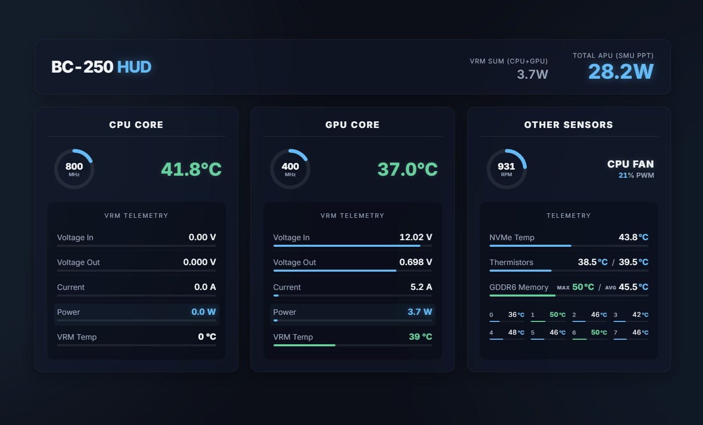

# BC-250 Telemetry


A telemetry daemon and web dashboard for the AMD BC-250 (Oberon / Cyan
Skillfish, `gfx1013`, PCI ID `1002:13fe`) — the decommissioned mining-board
APU carved out of the PS5. Runs on Bazzite, SteamOS, and CachyOS from the
same binary.

It merges two data sources into one JSON snapshot every ~700 ms:

- **Hardware (VRM/PMIC):** per-rail voltage, current, power, and
  temperature for the CPU and GPU rails. If the kernel `bc250_vrm` driver is
  loaded (linux-cachyos-bc250, or [bc250-vrm-dkms](https://github.com/Hexxeh/bc250-vrm-dkms))
  they are read from its hwmon device; otherwise the daemon talks PMBus to the
  PMIC (`0x60`) on the AMD SMBus itself. Either way, getting this bus exposed
  requires a small physical mod — see [hardware.md](hardware.md) and
  [Kernel drivers](#kernel-drivers-bc250_vrm--bc250_memory).
- **Software (Linux hwmon/sysfs):** die temperatures, clocks, power draw
  (PPT), and fan RPM/PWM, via the `amdgpu`, `k10temp`, `nct6686`, and `nvme`
  hwmon directories.

Everything is written atomically to `/run/apu_telemetry.json`, served by a
small bundled web server (`web/server.py`) on port 8090 with two dashboard
variants — `/` (classic HUD) and `/v2/` (animated board diagram), both
always reachable regardless of which one is the default.

Optional GDDR6 temperatures come from the kernel `bc250_memory` driver when
it is loaded, or else from a separate service that patches SMU at startup.
The installer asks whether to enable that service on a supported BC-250
P3.0 board (and skips it when the kernel driver is present);
`--memory-temp` / `--no-memory-temp` select it without a prompt.
The daemon includes `memory` in `/run/apu_telemetry.json`, and the API serves
that same snapshot. The v2 dashboard shows chip temperatures, average and
hotspot with freshness/error states; the classic dashboard is unchanged. See [memory service](memory/README.md)
for the JSON contract, compatibility checks and firmware limitations.
The SMU access and payload are adapted from
[pan-Rijovich/bc250-memory-temperature](https://github.com/pan-Rijovich/bc250-memory-temperature)
(MIT); see [memory/UPSTREAM.md](memory/UPSTREAM.md) and [memory/LICENSE.upstream](memory/LICENSE.upstream).

The web layer adds a third data source on top of that, at a much slower
cadence — CPU core / GPU Compute Unit counts, and overclock config/service
state — since none of it changes at 700 ms speed. See
[Topology & overclock endpoints](#topology--overclock-endpoints) below.

If no VRM is found, the daemon doesn't crash-loop — it logs the issue once,
retries with increasing back-off (and eventually stops probing the SMBus),
and keeps serving everything that doesn't depend on I2C (CPU/GPU clocks,
temperatures, fans).

## Kernel drivers (bc250_vrm / bc250_memory)

The daemon works with and without the community kernel drivers from
[linux-cachyos-bc250](https://github.com/MastaG/linux-cachyos-bc250),
[bc250-vrm-dkms](https://github.com/Hexxeh/bc250-vrm-dkms) and
[bc250-memory-dkms](https://github.com/Hexxeh/bc250-memory-dkms). With the
default `auto` settings nothing needs to be configured or blacklisted:

| Data | Kernel driver loaded | No kernel driver |
|---|---|---|
| VRM rails | read from `bc250_vrm` hwmon; the daemon never opens `/dev/i2c-*` | direct PMBus on the AMD SMBus (PIIX4) adapters only |
| GDDR6 | read from `bc250_memory` hwmon (every 3 s) | `bc250-memory.service`, if installed |

- **Do not run `bc250_memory` and `bc250-memory.service` together.** Both
  send SMU queue 3 messages; together they wedge the SMU and the fans ramp
  up. The service now refuses to start (and stops) when the module is
  loaded, and `install.sh` disables it when it detects the module.
  linux-cachyos-bc250 ships `bc250_memory` as opt-in (older builds blacklist
  it, newer ones simply have no autoload alias for it), so it is not loaded
  unless you ask for it; to switch from the service to the module:
  `sudo systemctl disable --now bc250-memory.service`, then
  `echo bc250_memory | sudo tee /etc/modules-load.d/bc250-memory.conf` and reboot.
- Blacklisting `bc250_vrm` is **no longer needed**. If you blacklisted it as
  a workaround for older releases you can remove that file
  (e.g. `/etc/modprobe.d/blacklist-vrm.conf`), rebuild the initramfs and reboot.
- Older releases probed every `/dev/i2c-*` bus every ~10 s when the PMIC was
  owned by `bc250_vrm`; that is what filled `dmesg` with
  `i2c i2c-5..8: SMBus Timeout` / `Failed! (01)`. Updating fixes it.
- With `bc250_vrm`, CoolerControl/`sensors` can also use the `bc250_vrm`
  hwmon device directly; the `/run/bc250` files below keep working either way.

The active sources are reported in the JSON (`"sources": {"vrm": "hwmon",
"memory": "collector"}`) and in `journalctl -u apu-telemetry`.

## Configuration

Settings live in `/etc/bc250-telemetry.conf` (installed with defaults on the
first install, never overwritten by updates). Apply changes without
reinstalling or restarting:

```bash
sudoedit /etc/bc250-telemetry.conf
apu_telemetry --check-config          # optional: report typos / bad values
sudo systemctl reload apu-telemetry
```

| Key | Values (default first) | Meaning |
|---|---|---|
| `vrm_source` | `auto`, `hwmon`, `pmbus`, `off` | VRM data source; `pmbus` is refused while a kernel driver owns the PMIC |
| `i2c_bus` | `auto`, `0`..`255` | bus for direct PMBus access |
| `memory_source` | `auto`, `hwmon`, `collector`, `off` | GDDR6 data source |
| `poll_interval_ms` | `700` (250..10000) | main polling period |
| `memory_poll_interval_ms` | `3000` (1000..10000) | `bc250_memory` polling period |
| `run_files` | `on`, `off` | write `/run/bc250/*` for CoolerControl/MangoHud |

Unknown keys and invalid values are reported in the journal and fall back to
the default — a bad config never stops the daemon. See
[config/bc250-telemetry.conf](config/bc250-telemetry.conf) for the commented
default file.

## CoolerControl (external / file sensors)

Without the `bc250_vrm` kernel driver, CPU and GPU **VRM** temperatures come
from PMBus, not from hwmon, so CoolerControl cannot pick them up
automatically. The daemon therefore also
writes them as Linux sysfs integers (millidegrees Celsius) for CoolerControl
**Custom Sensors → File**:

| Sensor | Path | Example contents |
|---|---|---|
| CPU VRM | `/run/bc250/cpu_vrm_temp` | `45000` (= 45 °C) |
| GPU VRM | `/run/bc250/gpu_vrm_temp` | `48000` (= 48 °C) |
| GDDR6 hotspot (optional) | `/run/bc250/memory_hotspot_temp` | `54000` (= 54 °C) |
| GDDR6 average (optional) | `/run/bc250/memory_avg_temp` | `48000` (= 48 °C) |

The two GDDR6 sensors exist only when GDDR6 temperatures are available (the
`bc250_memory` kernel driver or the memory-temp service, see
[memory service](memory/README.md)) — the files
are never created otherwise, so a File sensor pointed at a not-installed path
just shows no reading rather than 0 °C.

Die temps (k10temp / amdgpu), NCT, NVMe, and fans are already in hwmon —
add those from CoolerControl's normal device list, not as file sensors.

In CoolerControl: Settings → Custom Sensors → Add File sensor, point at one
of the paths above, unit = temperature (millidegrees Celsius). Files are only
created after a valid I2C/VRM reading; a later invalid sample leaves the last
good value in place so a fan curve does not drop to 0 °C.

## MangoHud

**PMBus / VRM** metrics, plus GDDR6 memory when that optional collector is
installed, go to `/run/bc250` — everything else is already in hwmon or
MangoHud's built-in lines (`cpu_temp`, `gpu_temp`, `cpu_mhz`,
`gpu_core_clock`, `gpu_power`, etc.). Human-readable strings for the overlay
(`custom_text` + `exec`, needs `legacy_layout=0`):

| Sensor | Path | Example contents |
|---|---|---|
| CPU VRM temp | `/run/bc250/cpu_vrm_c` | `45°C` |
| GPU VRM temp | `/run/bc250/gpu_vrm_c` | `48°C` |
| 12 V VIN | `/run/bc250/vin` | `12.22V` |
| CPU VOUT | `/run/bc250/cpu_vout` | `0.78V` |
| GPU VOUT | `/run/bc250/gpu_vout` | `0.65V` |
| CPU IOUT | `/run/bc250/cpu_iout` | `2.8A` |
| GPU IOUT | `/run/bc250/gpu_iout` | `12.0A` |
| CPU POUT | `/run/bc250/cpu_pout` | `2.2W` |
| GPU POUT | `/run/bc250/gpu_pout` | `7.8W` |
| VRM total | `/run/bc250/total_power` | `10.0W` |
| GDDR6 hotspot (optional) | `/run/bc250/memory_hotspot_c` | `54°C` |
| GDDR6 average (optional) | `/run/bc250/memory_avg_c` | `48°C` |

The two GDDR6 rows only exist when the memory-temp service (`--memory-temp`,
see [memory service](memory/README.md)) is installed and running — otherwise
those files are never created, and `exec=cat` on a missing path shows an
error in the overlay instead of a value. Only the hotspot and average are
exposed; an in-game overlay has no room for a per-chip breakdown the way the
web dashboards show one.

A drop-in fragment lives in [`mangohud/MangoHud-bc250.conf`](mangohud/MangoHud-bc250.conf), with a comment above its GDDR6 lines noting the same caveat. It sets `font_size_secondary=24` because MangoHud draws `custom_text`/`exec` in the secondary font (default 0.55× `font_size`).

## Screenshots

<table>
  <tr>
    <th align="center">Classic (<code>/</code>)</th>
    <th align="center">v2 — animated board diagram (<code>/v2/</code>)</th>
  </tr>
  <tr>
    <td align="center" valign="middle"></td>
    <td align="center" valign="middle"></td>
  </tr>
</table>

## Quick start

Download the latest release from
[GitHub Releases](../../releases/latest), extract it, and run:

```bash
cd bc250-telemetry
sudo ./install.sh
```

`install.sh` compiles the daemon (or falls back to the prebuilt
`apu_telemetry` binary next to it), sets up the `nct6683` fan-controller
module, installs the systemd units, asks about memory monitoring and which dashboard to serve by
default at `/` — classic (`v1`) or the animated diagram (`v2`); the other
stays reachable either way. To skip the prompt (e.g. for a scripted
install):

```bash
sudo ./install.sh --dashboard=v2   # or v1
```

Check that it's running:

```bash
sudo systemctl status apu-telemetry bc250-web.service
cat /run/apu_telemetry.json | jq .
```

Web UI:

```
http://<board-ip>:8090/       — classic HUD
http://<board-ip>:8090/v2/    — animated board diagram
```

Update (re-run over an already-running install):

```bash
sudo ./install.sh
```

Uninstall:

```bash
sudo ./uninstall.sh
```

<details>
<summary>Manual install, step by step</summary>

```bash
# Fan controller module (not autodetected on this board)
sudo sh -c 'echo "nct6683" > /etc/modules-load.d/99-sensors.conf'
sudo sh -c 'echo "options nct6683 force=true" > /etc/modprobe.d/sensors.conf'
sudo modprobe nct6683 force=true

# Daemon
g++ -std=c++17 -O2 -static bc250_telemetry.cpp -o ./apu_telemetry
sudo cp apu_telemetry /usr/local/bin/
[ -e /etc/bc250-telemetry.conf ] || sudo install -m 0644 config/bc250-telemetry.conf /etc/
sed "s|TELEMETRY_BIN_PATH|/usr/local/bin/apu_telemetry|" apu-telemetry.service \
    | sudo tee /etc/systemd/system/apu-telemetry.service > /dev/null
sudo systemctl daemon-reload
sudo systemctl enable --now apu-telemetry
```
</details>

## I2C bus override

Without the `bc250_vrm` kernel driver, the daemon looks for the PMIC
(`0x60`) only on the AMD SMBus (PIIX4) adapters, port 0 first, identifying it
with a read before it ever writes. It never touches the AMDGPU display
buses, and never a `0x60` device that a kernel driver has claimed. If nothing
answers it retries after 30 s, 1, 2, 5 and 10 minutes, then stops probing
(boards without the SMBus mod would otherwise log I2C errors forever);
`sudo systemctl reload apu-telemetry` starts over. To force a specific bus,
set `i2c_bus = 4` in `/etc/bc250-telemetry.conf`, or for a one-off run:

```bash
./apu_telemetry --bus 4
# or (overrides the config file; older installs set it in the unit)
BC250_I2C_BUS=4 ./apu_telemetry
```

## JSON output format

```json
{
  "hardware": {
    "cpu": { "valid": true, "vin": 12.22, "vout": 0.780, "iout": 2.8, "pout": 2.2, "temp": 45.0 },
    "gpu": { "valid": true, "vin": 12.22, "vout": 0.646, "iout": 12.0, "pout": 7.8, "temp": 48.0 },
    "total_power": 10.0,
    "total_power_valid": true
  },
  "software": {
    "cpu_temp_c": 51.4,
    "cpu_freq_mhz": 3400,
    "gpu_temp_c": 47.0,
    "gpu_sclk_mhz": 400,
    "gpu_ppt_w": 32.1,
    "nvme_temp_c": 38.0,
    "nct_t14_c": -1.0,
    "nct_t15_c": -1.0
  },
  "cooling": {
    "fan_rpm": 945,
    "fan_pwm_pct": 28
  },
  "sources": { "vrm": "hwmon", "memory": "collector" },
  "memory": {
    "valid": true,
    "status": "ok",
    "error": null,
    "age_ms": 120,
    "chips_c": [36, 34, 44, 36, 36, 42, 42, 38],
    "average_c": 38.5,
    "hotspot_c": 44,
    "hotspot_chip": 2,
    "saturated": false,
    "saturated_chips": [],
    "raw": [9766, 9509, 10794, 9766, 9766, 10537, 10537, 10023]
  }
}
```

- The `memory` object is always present. When no GDDR6 source is available or
  its data is unavailable/stale, `valid` is `false`, `chips_c` is eight nulls and
  the aggregates are null. With the kernel `bc250_memory` driver `raw` is an
  empty array (the driver exposes temperatures only). See
  [memory service](memory/README.md) for the full contract.
- `sources` names the active backends: `vrm` is `hwmon`, `pmbus`, `off` or
  `none`; `memory` is `hwmon`, `collector`, `off` or `none`.
- With `bc250_vrm`, the warning/fault flags are derived from the PMIC limits
  the driver exposes (`temp*_max`, `temp*_crit`, `curr*_crit`, read once);
  with direct PMBus they are the PMIC's latched STATUS bits.
- `cpu_freq_mhz` is the average across all CPU cores, not one arbitrary core.
- `total_power_valid` is `false` when the CPU or GPU VRM reading is currently
  invalid — `total_power` then reflects only the working side, not a real zero.
- Any field can be `-1` if that particular sensor isn't available; everything
  else keeps working independently.

## Topology & overclock endpoints

Two more endpoints, served straight by `web/server.py` (not the daemon) —
`/api/topology` and `/api/overclock`. Both are config/topology facts rather
than telemetry: they only change on a reboot, a live CU/WGP toggle, or an OC
config edit, so the dashboard fetches each once per page load instead of
polling them every 700 ms.

**`/api/topology`** — `web/topology.py`:

```json
{
  "cpu_physical_cores": 8,
  "gpu_cu_active": 40
}
```

- `cpu_physical_cores` comes straight from `/proc/cpuinfo`'s own "cpu cores"
  field (not threads ÷ 2 — a core disabled by binning isn't guaranteed to
  leave exactly half the threads intact).
- `gpu_cu_active` normally comes from the amdgpu driver via `libdrm_amdgpu`
  (`AMDGPU_INFO_DEV_INFO`). If `bc250-cu-live-manager.service` is active,
  that value is skipped in favor of its saved `/etc/bc250-cu-live-manager.conf`
  WGP table instead — the live-manager toggles CU dispatch by writing SPI/CC/RLC
  registers directly, *after* the driver has already cached its own count, so
  the driver's own number can be stale in that specific case.
- Either field is `null` if it can't be determined (no `/dev/dri` render
  node, `libdrm_amdgpu.so.1` missing, etc.) — the dashboard just hides the
  corresponding badge.

**`/api/overclock`** — `web/overclock.py`:

```json
{
  "cpu": {
    "config_present": true,
    "active": true,
    "target_freq_mhz": 4000,
    "max_temp_c": 90
  },
  "gpu": {
    "config_present": true,
    "active": true,
    "max_freq_mhz": 2000,
    "min_freq_mhz": 400
  }
}
```

- `cpu` reads `/etc/bc250-smu-oc.conf` (INI) and checks `bc250-smu-oc.service`.
  That service is a one-shot applier with no `RemainAfterExit` — it pushes the
  curve to the SMU once and exits, so `active` here means "the last run
  actually completed successfully" (`systemctl show` `Result`/`ExecMainStatus`
  gated on `LoadState`/`ExecMainStartTimestamp` so a never-installed unit
  doesn't look "active" by default), not "the process is still running".
- `gpu` reads `/etc/cyan-skillfish-governor-smu/config.toml`'s
  `[frequency-range]` table and checks `cyan-skillfish-governor-smu.service`.
  That one *is* a real long-running daemon, so `active` there means the
  usual `systemctl is-active`.
- `config_present: false` (config file missing or unreadable) means the tool
  simply isn't installed — the dashboard hides that panel entirely rather
  than showing zeros.
