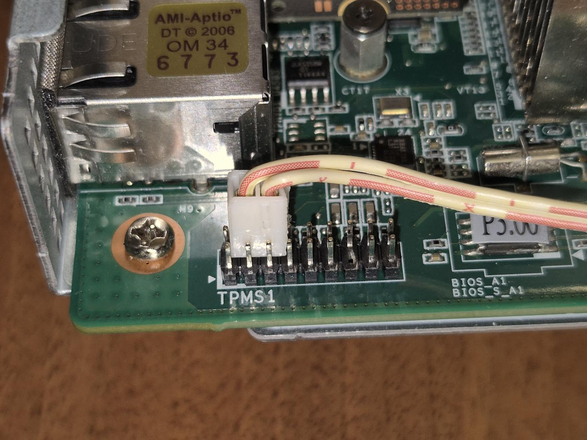
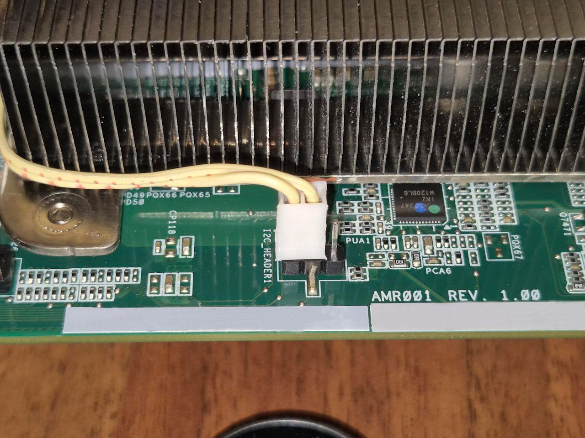
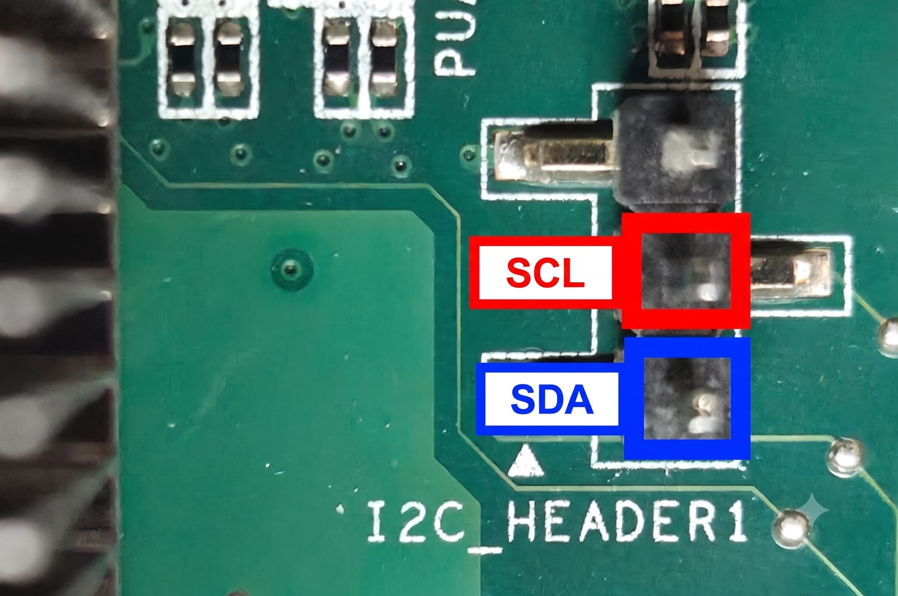
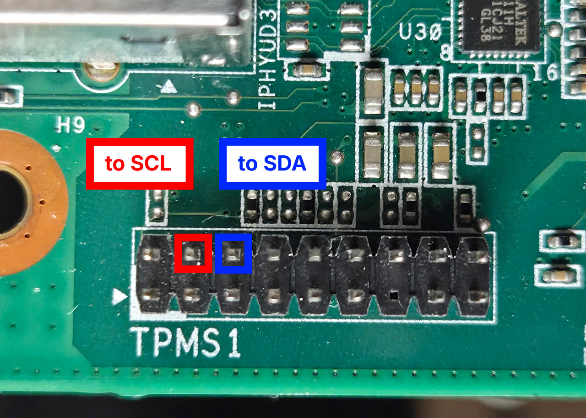
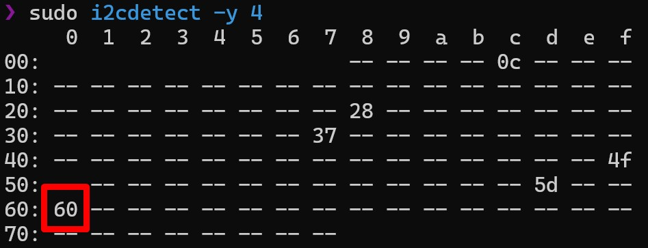

# Hardware Modification Guide

> [!WARNING]
> This involves wiring on a bare PCB with the power disconnected. If you're not comfortable working around board headers, ask someone who is.
>
> **No warranty, no guarantees, no liability.** This is a community mod on obscure salvaged hardware — I'm not responsible for anything that goes wrong on your board, your PSU, or anything else connected to it. You're doing this entirely at your own risk. Always double-check pinouts before powering anything back on.

This guide covers the physical mod required to get I2C/PMBus telemetry working on the BC-250. Software setup is covered in the main [README](README.md) — this doc is *just* the hardware side.

## Why you need to do this

**`I2C_HEADER1` and `TPMS1` are not connected to each other on the board — at all.** There's no trace, no existing link, nothing. This guide is about creating that connection yourself, with two jumper wires, so the board can actually talk to the PMBus controller sitting on that bus.

Per the [community hardware documentation for this board](https://elektricm.github.io/amd-bc250-docs/hardware/pinouts/):

> The SDA pin is on the "lower" side of the board, closer to the power connectors.
>
> This exposes an I2C interface which hosts PMBUS communications to the Intersil PMICs.
So `I2C_HEADER1` is where the bus is *exposed*, but it's dead on its own — `TPMS1` carries the actual live `SMB_CLK_MAIN` / `SMB_DATA_MAIN` signals from the LPC/debug side of the board. Bridging the two is what puts `I2C_HEADER1` on the live bus.

Once that physical link exists, the rest is software: the telemetry daemon uses the kernel's built-in I2C/SMBus support (`i2c-dev`) to read PMBus registers off that controller — voltage, current, temperature per rail — and writes it out for the rest of the system to consume. No custom hardware, no extra chips, just wire + the driver support that's already in the kernel. Software setup for that part is in the main [README](README.md).

## What you're connecting

Two headers are involved:

| Header | What it is | Relevant pins |
|---|---|---|
| **`I2C_HEADER1`** | 3-pin I2C header | `SDA`, `SCL`, `GND` |
| **`TPMS1`** | 18-pin 2.0mm LPC/TPM debug header | `SMB_CLK_MAIN` (pin 4), `SMB_DATA_MAIN` (pin 6) |

The short version: **`SCL` → pin 4, `SDA` → pin 6**. That's it — you don't need to run a separate GND jumper (more on that below). Full pinouts below if you need to double check orientation on your specific board.

### `I2C_HEADER1` pinout

```
> [ SDA  SCL  GND ]
```

> [!TIP]
> The `SDA` pin is on the "lower" side of the board, closer to the power connectors — useful for orienting the header if it's not clearly silkscreened on your revision.

### `TPMS1` pinout (18-pin, 2.0mm pitch)

```
  PCICLK -- [ 1   2 ] -- GND
   FRAME -- [ 3   4 ] -- SMB_CLK_MAIN     <-- connect to SCL
 PCIRST# -- [ 5   6 ] -- SMB_DATA_MAIN    <-- connect to SDA
    LAD3 -- [ 7   8 ] -- LAD2
      3V -- [ 9  10 ] -- LAD1
    LAD0 -- [11  12 ] -- GND
            [    14 ] -- S_PWRDWN#
    3VSB -- [15  16 ] -- SERIRQ#
     GND -- [17  18 ] -- GND
```

> [!NOTE]
> You only need pins **4** and **6** from `TPMS1` for this mod. The rest of the header is standard LPC debug signals — ignore them unless you're doing something unrelated.

> [!NOTE]
> **No separate GND jumper needed.** In testing, the bridge works fine with just `SCL`+`SDA` connected — no third wire to a `TPMS1` GND pin required. This is almost certainly because `I2C_HEADER1`'s `GND` pin and `TPMS1`'s `GND` pins already share a common ground plane elsewhere on the board, so there's already a return path without you having to add one. If you want to be extra sure on your specific board/revision, check continuity between `I2C_HEADER1` `GND` and any `TPMS1` `GND` pin with a multimeter first — if it beeps, you're good without the extra wire.

## Requirements

- **Wire:** the dual-wire connector from an old PC case's power/reset button cable works great here — right gauge, already a 2-pin housing, and every scrapped case has one lying around.
- **Alternative:** standard 40cm female-to-female Dupont jumper wires work too, *but* — `TPMS1` is **2.0mm pitch**, not the 2.54mm pitch Dupont connectors are built for. The housing will sit loose and can easily wiggle out. Cut off the Dupont connector on the `TPMS1` end and crimp/solder on something that actually matches 2.0mm pitch instead of trusting friction alone.
- Whatever connector you land on, it just needs to grip a 2.0mm pitch header reliably — get creative. I ended up using a connectors scavenged off an old satellite TV receiver (e-scrap gets a second life 🔧😄) — see below.
- Basic hand tools, plus female-to-female jumper wires for the pin-type headers
- Multimeter (strongly recommended — verify continuity before powering on)
- The board fully powered off and disconnected from the PSU

Here's the `TPMS1` side after connecting:



And the other end, plugged into `I2C_HEADER1` — silkscreen label visible on the PCB for reference if you're trying to locate it on your own board:



## Step-by-step

<!-- TODO(author): fill in your actual steps + photos here. Suggested structure below — swap in the real thing. -->

1. **Power down and disconnect the PSU completely.** Don't work on this with power connected, even if the board looks "off."
2. Locate `I2C_HEADER1` and `TPMS1` on your board. Exact pins to target, annotated (color coding is consistent across both: **red = SCL, blue = SDA**):

   

   

> [!CAUTION]
> **Don't mix up `SCL` and `SDA`.** Swap them and the bus most likely just won't work — `i2cdetect` will come back empty. It's not something that fries the board, but it's an easy mistake to make with two similar-looking wires, so double-check which is which before you commit each connection.

3. Connect `SCL` (I2C_HEADER1) → pin **4** (`SMB_CLK_MAIN`, TPMS1).
4. Connect `SDA` (I2C_HEADER1) → pin **6** (`SMB_DATA_MAIN`, TPMS1).
5. That's it — no GND jumper needed (see note above). If you want to double-check first, verify continuity between `I2C_HEADER1` `GND` and a `TPMS1` GND pin with a multimeter.
6. Double-check your connections against the pinout tables above **before** reconnecting power. A multimeter continuity check here is cheap insurance.

## Verifying it worked

Once the board is back up and running Linux, confirm the bus is actually live before assuming the daemon will pick anything up:

```bash
i2cdetect -l
sudo i2cdetect -y <bus_number>
```

> [!NOTE]
> `<bus_number>` varies by system, but on most BC-250 boards the PMBus segment this mod exposes turns out to be **bus 4**. Start there — `sudo i2cdetect -y 4` — before hunting through every bus on the `-l` list.

You should see a device respond at `0x60` (the primary PMBus PMIC — this is the address the telemetry daemon reads by default). If the bus shows nothing but empty cells, recheck your `SCL`/`SDA` wiring before assuming it's a software problem.

**Example output** (`sudo i2cdetect -y 4`), primary PMIC at `0x60` highlighted:



## Troubleshooting

<!-- TODO(author): add real symptoms you hit + fixes, e.g.:
     - "i2cdetect shows nothing" -> check X
     - "shows UU instead of an address" -> already claimed by a kernel driver, check Y
-->

| Symptom | Likely cause |
|---|---|
| `i2cdetect` shows nothing on the bus at all | `SCL`/`SDA` swapped (check this first), a bad joint, or (rarely) no shared ground on your specific board revision |
| Connections seem right but still nothing | Loose fit on `TPMS1` if you're using an unmodified 2.54mm-pitch connector on a 2.0mm-pitch header — recheck the connector, not just the wiring |
| Address shows as `UU` | Bus is claimed by a kernel driver already — not necessarily a problem, see main README |

## Acknowledgments

Huge thanks to **fansteori**, who was the first to figure out how to actually get VRM readings off this board and built the first working version of this project. None of this exists without the groundwork — and the push to keep going — that he brought to it.

## Credits

Pinout diagrams and header details from the [AMD BC-250 Documentation project](https://elektricm.github.io/amd-bc250-docs/hardware/pinouts/) ([elektricM/amd-bc250-docs](https://github.com/elektricM/amd-bc250-docs)). That project in turn credits the original reverse-engineering work to [mothenjoyer69's bc250-documentation](https://github.com/mothenjoyer69/bc250-documentation), with contributions from Segfault, neggles, and yeyus.
